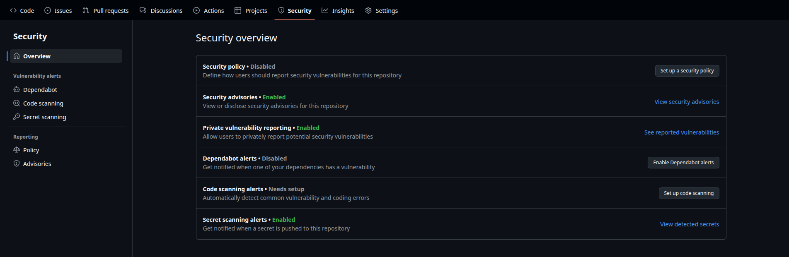

# Security Policy

If you have identified a security issue, do not open a public issue.

To report a security issue, please navigate to the "Security" tab for the repository, and click "Report a vulnerability".

Be sure to include as much detail as necessary in your report.